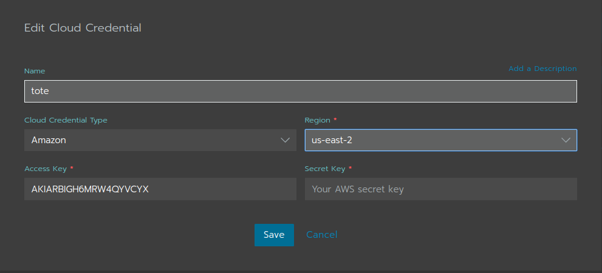
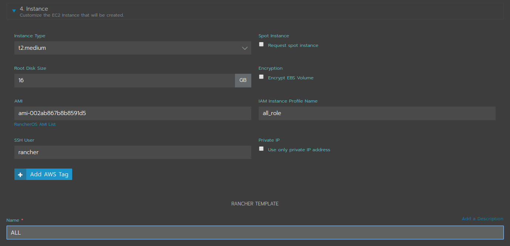
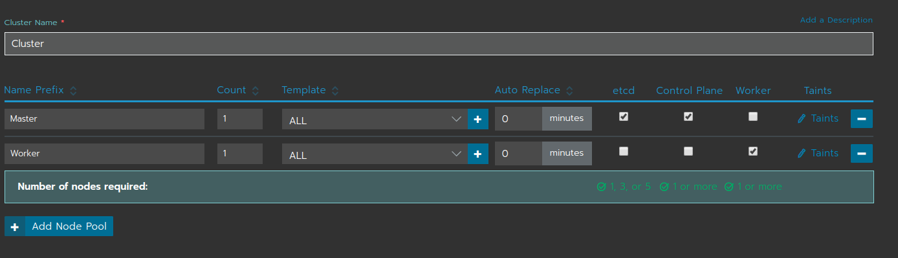

# INTRODUCCION AL PROYECTO.
Este proyecto consistirá en un aprendizaje del uso de contenedores y como orquestarlos entre máquinas. Para esto usaremos docker como gestor de contenedores y kubernetes como osquertador. El proyecto se dividirá en las siguientes partes.

- Introducción de gestor de contendor y orquestador.
- Entendimiento de como funciona Kubernetes y sus componentes mediante MiniKube.
- Creación de un clúster de Kubernetes en máquinas virtuales KVM.
- Creación de un clúster de alta disponibilidad con Rancher y AWS.

## CONTENEDORES Y ORQUESTADORES.

Un contenedor es un proceso que ha sido aislado de todos los demás procesos en la máquina anfitriona. Ese aislamiento aprovecha características de Linux como los namespaces del kernel y cgroups. Aunque es posible tener más de un proceso en un contenedor las buenas prácticas nos recomiendan ejecutar sólo un proceso por contenedor (PID 1).

Algunas ventajas son que podemos tener bastantes contenedores en máquinas puesto que comparten el mismo núcleo el contenedor que la máquina anfitriona, levantar un contenedor es rápido y también nos proporcionan que son portátiles puesto que tenemos la imagen.

Entre los gestores de contenedores destacan: Docker, Podman y LXD.

Un orquestador es una herramienta o sistema que automatiza el despliegue, gestión, escalado, interconexión y disponibilidad de los contenedores. 

Entre ellos tenemos: Docker Swarm, Kubernetes, Apache Mesos, OpenShift.

## QUE ES KUBERNETES Y PORQUE USARLO.
Kubernetes en una plataforma de código abierto para el despliegue, escalado y gestión de aplicaciones contenedorizadas.

Es software libre, que aunque es complejo es de los mas destacados por los componentes que ofrece (Pods, services…)

Al ser tan destacada herramientas como Rancher la utilizan, y eso hace que no sea tan compleja porque Rancher se encarga de su gestión

Por lo principal se utiliza con docker que eso hace que se asegure un funcionamiento rápido y eficaz

## CLUSTER DE KUBERNETES.
Esta compuesto por dos tipos de recursos.

- Master: Coordina todas las actividades del clúster como organizar aplicaciones, mantener el estado de aplicaciones, escalado, despliegue de actualizaciones. También recoge informacion de los nodos worker y los pods.

- Nodos: son workers que ejecutan las aplicaciones. Cada nodo contiene un agente llamado Kubelet que gestiona el nodo y mantiene la comunicación con el master.

En el despliegue de una aplicación en Kubernetes el master es el que inicia y organiza los contenedores para que se ejecuten en los nodos del clúster. La comunicación entre ellos se hace mediante la `API de Kubernetes`.

## ARQUITECTURA DE KUBERNETES.
En la siguiente imagen podemos ver los componentes mas importantes que tienen un master y un nodo.


- Plugins de red: Permiten la conexión entre pods de nodos diferentes y la integración de soluciones de red.
- Es una base de datos de clave-valor donde Kubernetes guarda todos los datos del clúster.
- API server: Componente del master que expone la API de Kubernetes
- Control manager: se encarga de comprobar si el estado deseado coincide con el de la realidad.
- Scheduler: Componente del master que observa que pods se han creado nuevos y no tienen nodo asignado, y les selecciona el nodo donde pueden ejecutarse.
- Kubelet: Agente que se ejecuta en cada nodo worker del clúster y que se asegura que los nodos están en ejecución y sanos. Kubelet no gestiona los pods que no han sido creados por kubernetes.
- Kube-proxy: Mantiene las reglas del networking en los nodos para los pods que se ejecutan en él de acuerdo con las especificaciones de los manifiestos.
- cAdvisor: Recoge los datos de uso de los contenedores.
- control plane: Nivel de orquestación de contenedores que expone la API para definir, desplegar y gestionar el ciclo de vida de los contenedores.
- Data plane: Nivel que proporciona los recursos, como CPU, memoria, red y almacenamiento, para que los pods se puedan ejecutar y conectar a la red.

# MINIKUBE.
Es una implementación ligera de kubernetes que crea una máquina virtual localmente y despliega un clúster sencillo formado por un solo nodo.
 - minikube start
 - minikube dashboard

## OBJETOS DE KUBERNETES.
Kubernetes tiene dos tipos de objetos, los básicos y los de nivel superior.

## PARA LA GESTION DE KUBECTL
- Para lanzar un archivo `YAML`
    - `kubectl apply -f ngnix.yaml`
- Para ver objetos:
    - `kubectl get all`
    - `kubectl get deployments`
    - `kubectl get nodes`
    - `kubectl get pods`
- Para eliminar objetos:
    - `kubectl delete deplyment [nombre]`
    - `kubectl delete node [nombre]`
    - `kubectl delete pod [nombre]`
    - `kubectl delete -f [archivo.yaml]`

## TIPOS DE SERVICIOS
- ClusterIP.
    - El servicio recibe una Ip interna a nivel de clúster y hace que el servicio solo sea accesible a nivel de clúster.
- NodePort.
    - Expone el servicio fuera del clúster concatenando la IP del nodo en el que esta el pod y un número de puerto entre 30000 y 32767, que es el mismo que todos los nodos.
- LoadBalancer.
    - Crea en cloud un balanceador externo con una IP externa asignada.
- ExternalName.
    - Expone el servicio usando un nombre.

Para crear uno de estos servicios hay que exponer el deployment y pasarle parámetro el tipo que queremos, por ejemplo yn tipo NodePort.

```
kubectl expose deployment jsonproducer --type=NodePort
```

## NAMESPACES
Todos los objetos creados están en un mismo espacio, llamado default, si quisiéramos cambiar ese espacio para tenerlo todo mejor organizado, tendríamos que crearlos.


Creacion de un NameSpace.
```
kubectl create namespace juan
```

Creacion de un deployment asignando un NameSpace.
```
kubectl run nginxtote --image=nginx --port 80 --namespace juan
```

Cambiar namespace.
```
kubectl config set-context --current --namespace=juan
```

En este ultimo, todo lo que nos pongamos a hacer afecta solo a los objetos que estén en este NamesSpace, todo lo que mostremos será a partir de esto, quiere decir que si en el NameSpace default tenemos un Deployment que que llame hello-minikube, si cambiamos de NameSpace a `juan` por ejemplo, al mostrar nuestros deployments o pods no los mostrará.

## ESCALADO DE APLICACION.
A la hora de crear un deployment se puede aumentar el número de replicas de pods que puede tener ese deploymment, y kubernetes automáticamente irá creando tantos pods como pongamos en las diferentes máquinas que tenga acceso. Gracias a esto es posible la actualización de aplicaciones en caliente.

Si ejecutamos un deployment de prueba podemos ver lo siguiente.
```
kubectl apply -f nginx.yaml
```
Nos sale esto:
```
NAME    READY   UP-TO-DATE   AVAILABLE   AGE
nginx   2/2     2            2           17s
```
- READY.
    - Nos dice el número de replicas(pods) tiene asignados y si están activos.
- UP-TO-DATE.
    - Nos indica número de replicas (pods) que están actualizados.
- AVAILABLE.
    - El número de replicas(pods) disponibles.

Ahora otro ejemplo.

Creamos un nuevo Deployment.
```
kubectl run jsonproducer --image=ualmtorres/jsonproducer:v0 --port 80
```

Y lo escalamos diciendo que queremos cuatro replicas.
```
kubectl scale deployments jsonproducer --replicas=4
```

Luego al obtener información ya sale que tenemos 4.
```
kubectl get deployments
```
```
NAME           READY   UP-TO-DATE   AVAILABLE   AGE
jsonproducer   4/4     4            4           73m
```

Una vez hecho esto kubernetes ira enviando los equipos que quieran ver esta conexión a los diferentes workers, con un sistema de balanceo que tiene Kubernetes.

Si queremos bajar el número de pods nos bastaría con poner el mismo comando que usamos para escalar pero con menos números, se encargara de borrar los que vea oportunos.

# K3S
## INSTALACION DE SERVIDOR DE K3S
Para la instalación del servidor de K3S necesitamos tener como minio un master y un worker, yo lo haré con un Master y dos workers.

Cuando las máquinas estén listas tenemos que empezar desde la máquina `master` a realizar las operaciones, procedemos a descargar el paquete K3S, como K3S por así decirlo es un comando, lo que haremos sera descargarlo directamente en una ruta del PATH como por ejemplo `/usr/local/bin`

```
cd /usr/lcoal/bin
```
Ahora descargamos el paquete.
```
wget https://github.com/rancher/k3s/releases/download/v0.2.0/k3s
```
Le proporcionamos permisos de ejecución.
```
chmod +x k3s
```
Para comenzar a desplegar el clúster con el nodo master tenemos que poner un comando muy sencillo.

```
k3s server &
```
Con esto el master ya esta listo y el clúster ya esta funcionando y podríamos ejecutar comandos `kubectl` siempre con el comando K3S por delante un ejemplo.
```
k3s kubectl get nodes
```
Y nos puede salir algo parecido a esto.
```
NAME     STATUS     ROLES    AGE   VERSION
master   Ready      <none>   27h   v1.13.4-k3s.1
```
Con esto el master esta listo, ahora tenemos que implementar los workers al clúster, empezamos accediendo a alguno de ellos y descargando el paquete y proporcionando permisos como en el `master` cuando todo eso este listo tenemos que ejecutar una instrucción.
```
k3s agent --server https://[IP_MAASTER]]:6443 --token [TOKEN_MASTER]
```
Nos encontramos con que no sabemos el token, esto lo podemos sacar en la máquina master en el siguiente archivo `/var/lib/rancher/k3s/server/node-token`

```
cat /var/lib/rancher/k3s/server/node-token
```
El contenido se ese archivo sera el token que necesitamos entonces el comando de arriba en mi caso quedaría algo así.

```
k3s agent --server https://192.168.122.2:6443 --token K10d6ccdb07ebdb6594f22aac004bfa36d6c0ed04d584bb295b8cdaf5c57ac582c5::node:5a2356bfd0d35a9fd2dbc55041727a08
```
Tendremos que hacer lo mismo con el otro worker y de esta manera mediante el nodo master podríamos ejecutar las intrucciones `kubectl`

```
k3s kubectl get nodes
```
```
NAME     STATUS   ROLES    AGE   VERSION
master   Ready    <none>   63m   v1.13.4-k3s.1
node1    Ready    <none>   36m   v1.13.4-k3s.1
node2    Ready    <none>   20m   v1.13.4-k3s.1
```

## CONFIGURACION DE KUBE EN UNA MAQUINA PARA MANEJAR EL CLUSTER.
Para configurar El clúster creado por K3s se podría hacer desde el master pero hay una forma mas cómoda, que es poder configurarlo desde otra máquina cliente o local, para ello en esa máquina debemos tener instalado Kubectl y algunas cosas que nos pueden servir.

INSTALACION DE ALGUNOS PAQUETES QUE NOS HACEN FALTA.
```
apt update && apt install apt-transport-https curl git -y
```

INSTALACION DE KUBECTL
```
curl -s https://packages.cloud.google.com/apt/doc/apt-key.gpg | sudo apt-key add -
echo "deb https://apt.kubernetes.io/ kubernetes-xenial main" | sudo tee -a /etc/apt/sources.list.d/kubernetes.list
apt-get update
apt install kubectl -y
```
Cuando este instalado lo configuraremos para que coja todas las credenciales y demás del nodo master, para ello lo hacemos mediante un archivo de configuración, creamos en nuestra carpeta personal una carpeta que se llame `.kube` de ahí nos conectamos al master mediante scp para coger un archivo de configuración que se encuentra en `/etc/rancher/k3s` y se llama `k3s.yaml`. Lo cogemos a nuestra máquina con el nombre de config, de la siguiente manera.

```
mkdir .kube
cd .kube
scp [IP_MASTER]:/etc/rancher/k3s/k3s.yaml config
```

Cuando lo tengamos tendremos que editarlo porque esta configurado para la máquina local, tendremos que decirle donde se encuentra el master, así que la linea siguiente

```
https://localhost:6443
```
Cambiamos localhost por la Ip del master en mi caso
```
server: https://192.168.122.2:6443
```
Cuando lo tengamos configurado solo nos falta general una variable de entorno para kubernetes y decirle que todos los comandos realizados coja información del archivo que acabamos de configurar, de la siguiente forma.
```
export KUBECONFIG=~/.kube/config
```

De este modo si ahora probamos a ejecutar la orden `kubectl get nodes` nos saldrá la información de los nodos como podría ser esta
```
NAME     STATUS   ROLES    AGE   VERSION
master   Ready    <none>   63m   v1.13.4-k3s.1
node1    Ready    <none>   36m   v1.13.4-k3s.1
node2    Ready    <none>   20m   v1.13.4-k3s.1
```
Ahora podríamos hacer cualquier cosa con kubernetes y el master estaría balanceado entre los nodos

Como prueba podemos crear por ejemplo un deployment con nginx
```
kubectl create deploy nginx --image=nginx
```
Si obtenemos la información de los deployments y los pods con la siguiente orden
```
kubectl get deployments,pod
```
Podemos ver algo parecido a esto
```
NAME                          READY   UP-TO-DATE   AVAILABLE   AGE
deployment.extensions/nginx   1/1     1            1           85s

NAME                       READY   STATUS    RESTARTS   AGE
pod/nginx-5c7588df-kklnn   1/1     Running   0          85s
```
Para la conexion a ese pod que hemos creado vamos por medio de la IP del nodo master y creando un servicio de tipo nodeport
```
kubectl expose deploy nginx --port=80 --type=NodePort
```
Cuando esto termine podemos ver en que puerto se ha mapeado mostrando los servicios con kubectl
```
kubectl get services
```
Ahora podríamos probar a escalar la aplicación y que ejecuten varios pods.
```
kubectl scale --replicas=3 deploy/nginx
```
Y si mostramos los pods
```
NAME                   READY   STATUS    RESTARTS   AGE
nginx-5c7588df-54ls6   1/1     Running   0          37s
nginx-5c7588df-kklnn   1/1     Running   0          12m
nginx-5c7588df-vf8gt   1/1     Running   0          37s
```
También podríamos ver en que nodo se esta ejecutando cada uno.
```
kubectl get pod -o wide
```
```
NAME                   READY   STATUS    RESTARTS   AGE     IP          NODE     NOMINATED NODE   READINESS GATES
nginx-5c7588df-54ls6   1/1     Running   0          2m35s   10.42.1.3   node1    <none>           <none>
nginx-5c7588df-kklnn   1/1     Running   0          14m     10.42.2.2   node2    <none>           <none>
nginx-5c7588df-vf8gt   1/1     Running   0          2m35s   10.42.0.6   master   <none>           <none>
```
Si hacemos un cuarto escalado podríamos ver que una de los nodos á dos, en mi caso el nodo1
```
NAME                   READY   STATUS    RESTARTS   AGE     IP          NODE     NOMINATED NODE   READINESS GATES
nginx-5c7588df-4wl5t   1/1     Running   0          9s      10.42.1.4   node1    <none>           <none>
nginx-5c7588df-54ls6   1/1     Running   0          4m56s   10.42.1.3   node1    <none>           <none>
nginx-5c7588df-kklnn   1/1     Running   0          17m     10.42.2.2   node2    <none>           <none>
nginx-5c7588df-vf8gt   1/1     Running   0          4m56s   10.42.0.6   master   <none>           <none>
```

# RANCHER

Rancher es una aplicación Web que nos permite el uso de Kubernetes de una forma gráfica, usándolo en un servidor privado con nuestra infraestructura o clouds de Internet como pueden ser:
- Amazon Web Services.
- Azure.
- Google container engine.
- DigitalOcean
- Custom

Rancher es una pila completa de software para equipos que adoptan contenedores. Aborda los desafíos operativos y de seguridad de administrar múltiples clústeres de Kubernetes en cualquier infraestructura, al tiempo que proporciona a los equipos de DevOps herramientas integradas para ejecutar cargas de trabajo en contenedores.

Algunas de las características de Rancher podrían ser:

- Gestión centralizada de cualquier grupo de Kubernetes
- Una plataforma empresarial para administrar Kubernetes en todas partes
- Sin ninguna plataforma de nube, puede ser personalizado
- Aprovisionamiento de clúster

## INSTALACION DE RANCHER
Para esto lanzaremos una máquina ec2 en nuestro AWS 

NOTA: PARA QUE RANCHER FUNCIONE MINIMO TIENE QUE SER UNA MAQUINA DE t2.small

Cuando esa máquina este disponible tendremos que actualizar la máquina e instalar docker.
```
apt update && apt install docker.io -y
```
Cuando lo tengamos bastara con lanzar un contendor en docker y podremos acceder a rancher desde el navegador.
```
docker run -d -p 80:80 -p 443:443 rancher/rancher
```
Nos pedirá que necesitamos proporcionar una clave para acceder al administrador de rancher

NOTA:RECOMIENDO QUE AUNQUE SEA UNA PRUEBA LA CLAVE SEA SEGURA PORQUE MAS TARDE LE DAREMOS A RANCHER NUESTRAS CEDENCIALES Y CUALQUIERA PODRIA HACER COSAS SI ACCEDEN CON UNA CLAVE FACIL.

Después de eso nos dejara acceder a rancher perfectamente.

## CONFIGURACION DE PERMISOS DE AWS.

Para que todo lo que queremos hacer funcione necesitamos gestionar un servicio que nos ofrece AWS que se trata de IAM, con esto crearemos un usuario para rancher que le permita el acceso a nuestro AWS.

## CREACION DE UN USUARIO EN AWS Y PROPORCIONARLE PERMISOS.

Lo primero es crear el usuario que eso debemos de ir a los servicios de AWS y buscar IAM, allí a la seccion de usuario y como no tenemos ningún usuario nos sugiere crear uno.

Rellenamos el nombre de usuario y después tenemos que seleccionar que tipo de acceso tendrá ese usuario, seleccionaremos el segundo, que s mediante consola. La clave podemos escoger una o que la genere automática, sugiero automática.


Seguidamente nos pedirá que lo metamos en un grupo para darle permisos, esto por ahora lo dejamos, lo haremos mas tarde. Seguimos creando el usuario dándole a siguiente hasta terminar todos los paso no hay que rellenar nada mas.

Cuando hagamos esto pasaremos a crear políticas y roles de IAM (`Permisos`)

Crearemos una política para el `controlpane` de nuestro futuro clúster de kubernetes para crear una política iremos a IAM, política,crear política, hay dos formas de hacer esto que es ir seleccionando que permisos queremos proporcionar y el otro mediante un archivo JSON que es lo mismo que lo otro pero es en código os mostrare como seria el de código.

```
{
    "Version": "2012-10-17",
    "Statement": [
        {
            "Effect": "Allow",
            "Action": [
                "autoscaling:DescribeAutoScalingGroups",
                "autoscaling:DescribeLaunchConfigurations",
                "autoscaling:DescribeTags",
                "ec2:DescribeInstances",
                "ec2:DescribeRegions",
                "ec2:DescribeRouteTables",
                "ec2:DescribeSecurityGroups",
                "ec2:DescribeSubnets",
                "ec2:DescribeVolumes",
                "ec2:CreateSecurityGroup",
                "ec2:CreateTags",
                "ec2:CreateVolume",
                "ec2:ModifyInstanceAttribute",
                "ec2:ModifyVolume",
                "ec2:AttachVolume",
                "ec2:AuthorizeSecurityGroupIngress",
                "ec2:CreateRoute",
                "ec2:DeleteRoute",
                "ec2:DeleteSecurityGroup",
                "ec2:DeleteVolume",
                "ec2:DetachVolume",
                "ec2:RevokeSecurityGroupIngress",
                "ec2:DescribeVpcs",
                "elasticloadbalancing:AddTags",
                "elasticloadbalancing:AttachLoadBalancerToSubnets",
                "elasticloadbalancing:ApplySecurityGroupsToLoadBalancer",
                "elasticloadbalancing:CreateLoadBalancer",
                "elasticloadbalancing:CreateLoadBalancerPolicy",
                "elasticloadbalancing:CreateLoadBalancerListeners",
                "elasticloadbalancing:ConfigureHealthCheck",
                "elasticloadbalancing:DeleteLoadBalancer",
                "elasticloadbalancing:DeleteLoadBalancerListeners",
                "elasticloadbalancing:DescribeLoadBalancers",
                "elasticloadbalancing:DescribeLoadBalancerAttributes",
                "elasticloadbalancing:DetachLoadBalancerFromSubnets",
                "elasticloadbalancing:DeregisterInstancesFromLoadBalancer",
                "elasticloadbalancing:ModifyLoadBalancerAttributes",
                "elasticloadbalancing:RegisterInstancesWithLoadBalancer",
                "elasticloadbalancing:SetLoadBalancerPoliciesForBackendServer",
                "elasticloadbalancing:AddTags",
                "elasticloadbalancing:CreateListener",
                "elasticloadbalancing:CreateTargetGroup",
                "elasticloadbalancing:DeleteListener",
                "elasticloadbalancing:DeleteTargetGroup",
                "elasticloadbalancing:DescribeListeners",
                "elasticloadbalancing:DescribeLoadBalancerPolicies",
                "elasticloadbalancing:DescribeTargetGroups",
                "elasticloadbalancing:DescribeTargetHealth",
                "elasticloadbalancing:ModifyListener",
                "elasticloadbalancing:ModifyTargetGroup",
                "elasticloadbalancing:RegisterTargets",
                "elasticloadbalancing:SetLoadBalancerPoliciesOfListener",
                "iam:CreateServiceLinkedRole",
                "kms:DescribeKey"
            ],
            "Resource": [
                "*"
            ]
        }
    ]
}
```
Lo que estamos haciendo en esta política es darle a todo aquel que este asociado a esta política el poder de los permisos como ejecutar instancias, borrarlas, crear security groups y todo lo relacionado para la gestión que necesita rancher para la creación del clúster.

Después revisamos la política le ponemos un nombre por ejemplo `controlpane_policy` y la creamos.

Ahora tendremos que hacer una para el `etcd y worker`, el mismo proceso pero el contenido del JSON es diferente, es este

```
{
    "Version": "2012-10-17",
    "Statement": [
        {
            "Effect": "Allow",
            "Action": [
                "ec2:DescribeInstances",
                "ec2:DescribeRegions",
                "ecr:GetAuthorizationToken",
                "ecr:BatchCheckLayerAvailability",
                "ecr:GetDownloadUrlForLayer",
                "ecr:GetRepositoryPolicy",
                "ecr:DescribeRepositories",
                "ecr:ListImages",
                "ecr:BatchGetImage"
            ],
            "Resource": "*"
        }
    ]
}
```
La revisamos y por ejemplo la podemos llamar `etcd_worker_policy`

Lo siguiente es crear roles y asociarlos cada uno a su política. Para ellos nos vamos a IAM, roles y nuevo rol. Aquí asociaremos la política para cada uno de los roles, por ejemplo si estamos creando el rol de `controlpane` le asociamos la política de `controlpane_policy` y a ese rol podemos llamarle `controlpane_role`. Creamos también el rol para `etcd_worker_policy` y la llamamos `etcd_worker_role`.

Importante crear otra política que una estas dos, es decir, creamos otro rol que y le asociamos `controlpane_policy` y `etcd_worker_policy` y por ejemplo podemos llamarla `all_role`

Ahora volveríamos a la creacion de política para crear la ultima política que nos hace falta `PASSROLE`

Necesitaremos lo siguiente
- ID de nuestra cuenta de AWS, esto lo podemos encontrar dando en nuestro nombre de usuario arriba a la derecha, mi cuenta.
- REGION esto lo podemos encontrar arriba a la derecha donde pone al lado de nuestro nombre de usuario encontraremos el estado donde estamos y si pulsamos nos dirá nuestra región, en mi caso es `us-east-2`

En el siguiente archivo JSON hay datos que hay que cambiar dependiendo de nuestra `REGION, ID_CUENTA, NOMBRE DE ROLES`

```
{
    "Version": "2012-10-17",
    "Statement": [
        {
            "Sid": "VisualEditor0",
            "Effect": "Allow",
            "Action": [
                "ec2:AuthorizeSecurityGroupIngress",
                "ec2:Describe*",
                "ec2:ImportKeyPair",
                "ec2:CreateKeyPair",
                "ec2:CreateSecurityGroup",
                "ec2:CreateTags",
                "ec2:DeleteKeyPair"
            ],
            "Resource": "*"
        },
        {
            "Sid": "VisualEditor1",
            "Effect": "Allow",
            "Action": [
                "ec2:RunInstances",
                "iam:PassRole"
            ],
            "Resource": [
                "arn:aws:ec2:REGION::image/ami-*",
                "arn:aws:ec2:REGION:ID_CUENTA:instance/*",
                "arn:aws:ec2:REGION:ID_CUENTA:placement-group/*",
                "arn:aws:ec2:REGION:ID_CUENTA:volume/*",
                "arn:aws:ec2:REGION:ID_CUENTA:subnet/*",
                "arn:aws:ec2:REGION:ID_CUENTA:key-pair/*",
                "arn:aws:ec2:REGION:ID_CUENTA:network-interface/*",
                "arn:aws:ec2:REGION:ID_CUENTA:security-group/*",
                "arn:aws:iam::ID_CUENTA:role/etcd_worker_role",
                "arn:aws:iam::ID_CUENTA:role/controlpane_role"
            ]
        },
        {
            "Sid": "VisualEditor2",
            "Effect": "Allow",
            "Action": [
                "ec2:RebootInstances",
                "ec2:TerminateInstances",
                "ec2:StartInstances",
                "ec2:StopInstances"
            ],
            "Resource": "arn:aws:ec2:REGION:ID_CUENTA:instance/*"
        }
    ]
}
```

Cuando tengamos esto solo nos faltaría volver a los roles y crear el rol para la política de `PASSROLE` como hemos hecho con las políticas anteriores.

Lo siguiente como nos habíamos dejado el usuario sin darle los permisos ahora es el momento ya que los acabamos de hacer, nos tendríamos que ir a IAM, usuarios, 'nuestro usuario', agregar permisos, crear grupo nos saldrá la lista de políticas, aquí agregamos las tres políticas que hemos creado antes `controlpane_policy, etcd_worker_policy` y `passrole_policy`. Por ejemplo le podemos llamar `policy_group`

## AGREGAR CREDENCIALES DE AWS A RANCHER.
Cuando nos vayamos a rancher tenemos que hacer dos cosas previas darle credenciales de AWS del usuario que hemos creado, en rancher nos vamos a `cloud credentials`, `add cloud credential`.

Nos pedirá el nombre, tipo de nube(Amazon), nuestra región(Como la que hemos puesto en las políticas), access key y secret key.

Para con seguir el `access key` y `secret key` debemos de ir a AWS y entrar en IAM, usuarios, credenciales de seguridad y le debemos dar a crear una nueva clave de acceso entonces AWS nos dará ambas cosas y las ponemos en rancher.



## CONFIGURAR NODE TEMPLATES
Lo que vamos a configurar a continuación es las características de máquinas de los nodos, al darle a agregar nodo nos dirá que tipo de Nube que es Amazon, la región y nuestra cloud credentials las zonas de red que hay en nuestra región ponemos las que queramos y la subred cogemos la que tenemos por defecto. Cuando le demos a siguiente tocaran los puertos abiertos para la máquina que ponemos que default de rancher esto abrirá los que rancher crea oportunos.

Lo siguiente son las especificaciones de la máquina que podemos escoger la instancia que queramos.
- AMI: Aquí tendremos que poner una ami de rancher que la ami cambia según al región, dejo un enlace para que se vea la ami según tu región
```
https://github.com/rancher/os/blob/master/README.md/#user-content-amazon
```
- IAM INSTANCE PROFILE NAME: Aquí ponemos el nombre del rol en el que hemos juntado las dos políticas antes, el que yo he llamado `all_role`
- SSH User: Aquí tenemos que poner `rancher`



Y por ultimo poner el nombre del node.

Para que sirve esto de NODE template realmente. por ejemplo si queremos que el master o los worker sean máquinas diferentes configuramos la máquina de una forma u otra creando varios.

## CREACION DEL CLUSTER
Ya por ultimo crear el clúster, nos vamos a clúster y add clúster, seleccionamos el ec2 y le ponemos nombre a nuestro clúster

Ponemos un prefijo a la máquina, seleccionamos el template que hayamos creado y luego tenemos que seleccionar que nodos serán `etcd, controlpane o worker` podemos poner hasta cuantas queremos crear.



Luego mas abajo nos pondrá que cloud provider, deberemos seleccionar que Amazon y damos en create y el clúster se empieza a crear.

## LEVANTAR ALGUNA IMAGEN EN EL CLUSTER QUE HEMOS CREADO.
Para hacer un deploy tenemos que irnos a nuestro clúster, system. Desde ahí a la derecha nos sale deploy y seguidamente la configuración del deploy como su nombre, su docker image, si queremos crearle algún servicio y tal.

Mas abajo tendremos las variables que tendrá la imagen de docker, los volúmenes que podemos usar con `secret o config map`. Como un archivo yaml pero en modo gráfico, si queremos importat nuestro archivo porque ya lo tenemos listo también lo podemos hacer. Y para finalizar simplemente le damos a launch.


Si por ejemplo hemos creado un nodeport y queremos acceder a esa máquina desde el exterior en el menú de System nos sale nuestro nuevo pod que si nos fijamos debajo de su nombre tenemos el puerto que ha generado rancher random o si hemos puesto nosotros uno manual, solo tenemos que o bien darle ahí y nos lleva automáticamente o también si queremos acceder nosotros con ip tendríamos que coger la IP del MASTER junto a ese puerto.


## AUTO ESCALADO HORIZONTAL CON RANCHER.
Esto se hace mediante HPA, en los pods hay que limitarles los milicpu, sino no nos dejara ponerle un HPA.

Al crear un Deploy tenemos que ver las opciones avanzadas de la creacion e irnos a `Security & Host config` y aquí bajar hasta encontrar CPU reservation y limitarle las CPUs. Si lo dejamos sin reservar HPA no podrá realizar el escalado, para probar podemos reservar pocas, por ejemplo 100 o 200 y darle a Launch.


Seguidamente tenemos que ir a System, resources, HPA, add HPA.

Le pondremos un nombre, selecionamos en que namespace se encuentra, y nuestro workload(pod), nuestras replicas como mínimo y máximo.

Y ya abajo la métrica, que puede ser o de CPU o re memoria RAM, recomiendo la de porcentaje de CPU


Ahora, como podemos probar esto, muy fácil, con la herramienta de apache `apache benchmark` que sino lo tienes instalado en tu Linux basta con lo siguiente.

```
apt isntall apache2_utils
```

Este comando funciona de la siguiente manera, envía un total de peticiones, y también las que le digamos simultáneamente, se vería de la siguiente forma.
```
ab -n100000 -c100 http://IP_SERVER/
```

En este casp envía 100000 peticiones y va enviando 100 simultáneamente, a la dirección que tengamos nuestro pod (Dirección NodePort)

Cuando hagamos esto el HPA si ve que sobrepasa el limite establecido lo ira escalando cuanto sea necesario hasta el máximo que pongamos.


En la siguiente imagen lo he sobrepasado y según el porcentaje, ha tenido que crear otros 4 pods idénticos.

# REFERENCIAS.

- [Documentación de kubernetes](https://kubernetes.io/docs/home/)
- [Documentación de AWS](https://docs.aws.amazon.com/)
- [Documentación de Rancher](https://rancher.com/docs/)
- [Kubernetes. Un orquestador de contenedores que debes poner en tu vida](https://ualmtorres.github.io/SeminarioKubernetes/)
- [How to Build a Kubernetes Clúster With EC2 and Rancher 2](https://medium.com/@ryan_42188/how-to-build-a-kubernetes-cluster-with-ec2-and-rancher-2-812eaaec473e)