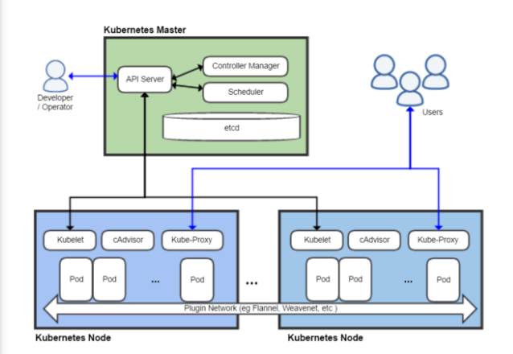

# Teoria.
## CONTENEDORES Y ORQUESTADORES.

Un contenedor es un proceso que ha sido aislado de todos los demás procesos en la máquina anfitriona. Ese aislamiento aprovecha características de Linux como los namespaces del kernel y cgroups. Aunque es posible tener más de un proceso en un contenedor las buenas prácticas nos recomiendan ejecutar sólo un proceso por contenedor (PID 1).

Algunas ventajas son que podemos tener bastantes contenedores en maquinas puesto que comparten el mismo núcleo el contenedor que la maquina anfitriona, levantar un contenedor es rápido y también nos proporcionan que son portátiles puesto que tenemos la imagen.

Entre los gestores de contenedores destacan: Docker, Podman y LXD.

Un orquestador es una herramienta o sistema que automatiza el despliegue, gestión, escalado, interconexión y disponibilidad de los contenedores. 

Entre ellos tenemos: Docker Swarm, Kubernetes, Apache Mesos, OpenShift.

## QUE ES KUBERNETES Y PORQUE USARLO.
Kubernetes en una plataforma de codido abierto para el despligue, escalado y gestion de aplicaciones contenedorizadas.

Es software libre, que aunque es complejo es de los mas destacados por los componentes que ofrece (Pods, services…)

Al ser tan destacada herramientas como Rancher la utilizan, y eso hace que no sea tan compleja porque Rancher se encarga de su gestión

Por lo principal se utiliza con docker que eso hace que se asegure un funcionamiento rápido y eficaz

## CLUSTER DE KUBERNETES.
Esta compuesto por dos tipos de recursos.

- Master: Coordina todas las actividades del cluster como organizar apicaciones, mantener el estado de aplicaciones, escalado, despliegue de actualizaciones. Tambien recoge informacion de los nodos worker y los pods.

- Worker: son workers que ejecutan las aplicaciones. Cada nodo contiene un agente llamado Kubelet que gestiona el nodo y mantiene la comunicacion con el master.

En el despliegue de una aplicacion en Kubernetes el master es el que inicia y organiza los contenedores para que se ejecuten en los nodos del cluster. La comunicacion entre ellos se hace mediante la `API de Kubernetes`.

## ARQUITECTURA DE KUBERNETES.
En la siguiente imagen podemos ver los componentes mas importantes que tienen un master y un nodo.



- Plugins de red: Permiten la conexion entre pods de nodos difrerentes y la integracion de soluciones de red.
- Es una base de datos de clave-valor donde Kubernetes guarda todos los datos del cluster.
- API server: Componente del master que expone la API de Kubernetes
- Control manager: se encarga de comprobar si el estado deseado coincide con el de la realidad.
- Scheduler: Componente del master que obserba que pods se han creado nuevos y no tienen nodo adignado, y les selecciona el nodo donde pueden ejecutarse.
- Kubelet: Agente que se ejecuta en cada nodo worker del cluster y que se asegura que los nodos estan en ejecucion y sanos. Kubelet no gestiona los pods que no han sido creados por kubernetes.
- Kube-proxy: Mantiene las reglas del networking en los nodos para los pods que se ejecutan en él de acuerdo con las especificaciones de los manifiestos.
- cAdvisor: Recoge los datos de uso de los contenedores.
- control plane: Nivel de orquestacion de contenedores que expone la API para definir, desplegar y gestionar el ciclo de vida de los contenedores.
- Data plane: Nivel que proporciona los recursos, como CPU, memoria, red y almacenamiento, para que los pods se puedan ejecutar y conectar a la red.

## Componentes de kubernetes.
Deployment: El deployment pide a kubernetes que cree o actualice instancias, una vez que la aplicación esta desplegada las monitoriza por si estas están erróneas o mueren se encarga de reemplazarlas por otras idénticas en otro nodo del clúster

Pods: Un pod es una abstracción de kubernetes que representa uno o mas recursos como pueden ser contenedores, volúmenes o redes

Services: Los servicios es lo que Kubernetes utiliza para la conexión entre maquinas por medio de los puertos, hay varios tipos de servicios como clúster IP, NodePort, LoadBalancer y ExternalName

## TIPOS DE SERVICIOS
- ClusterIP.
    - El servicio recibe una Ip interna a nivel de cluster y hace que el servicio solo sea accesible a nivel de cluster.
- NodePort.
    - Expone el servicio fuera del cluster concatenando la IP del nodo en el que esta el pod y un numero de puerto entre 30000 y 32767, que es el mismo que todos los nodos.
- LoadBalancer.
    - Crea en cloud un balanceador externo con una IP externa asignada.
- ExternalName.
    - Expone el servicio usando un nombre.

Para crear uno de estos servicios hay que exponer el deployment y pasarle parametro el tipo que queremos, por ejemplo yn tipo NodePort.

## RANCHER

Rancher es una aplicación Web que nos permite el uso de Kubernetes de una forma grafica, usándolo en un servidor privado con nuestra infraestructura o clouds de Internet como pueden ser:
- Amazon Web Services.
- Azure.
- Google container engine.
- DigitalOcean
- Custom

Rancher es una pila completa de software para equipos que adoptan contenedores. Aborda los desafíos operativos y de seguridad de administrar múltiples clústeres de Kubernetes en cualquier infraestructura, al tiempo que proporciona a los equipos de DevOps herramientas integradas para ejecutar cargas de trabajo en contenedores.

Algunas de las características de Rancher podrían ser:

- Gestión centralizada de cualquier grupo de Kubernetes
- Una plataforma empresarial para administrar Kubernetes en todas partes
- Sin ninguna plataforma de nube, puede ser personalizado
- Aprovisionamiento de clúster

## Por que Rancher.
Rancher es una pila completa de software para equipos que adoptan contenedores. Aborda los desafíos operativos y de seguridad de administrar múltiples clústeres de Kubernetes en cualquier infraestructura, al tiempo que proporciona a los equipos de DevOps herramientas integradas para ejecutar cargas de trabajo en contenedores.

Algunas de las características de Rancher podrían ser:

- Gestión centralizada de cualquier grupo de Kubernetes
- Una plataforma empresarial para administrar Kubernetes en todas partes
- Sin ninguna plataforma de nube, puede ser personalizado
- Aprovisionamiento de clúster

# Demostracion

## Instalacion de rancher y configuracion incial con docker.

```
apt update && apt install docker.io -y
docker run -d -p 80:80 -p 443:443 rancher/rancher
```
Comentar que despues de su instalacion habra que poner una password segura

## Configuracion de amazon
- Politicas.
    - Como crear politicas.
    - Que politicas.
    - Para que sirven.
- Roles.
    - Como crear roles.
    - Que roles.
    - Para que sirven.
- Usuarios.
    - Como crear usuarios 
    - Agregar las politicas que hemos creado
    - Crearles credenciales de seguridad.

## Credenciales de seguridad en Rancher.
- Mostrar donde se le proporcionan a racher las credenciales de seguridad

## Creacion de node templates.
- Explicacion de que es cada cosa a la hora de crear un NodeTemplate.

## Creacion de un cluster
- Como se crea el cluster usando los NodeTemplates y AWS

## Creacion de contenedores en e cluster.
- apache2 con NodePort para ver como se usa el servicio
- Creacion de MySQL con ClusterIP y con las variables de creacion de una base de datos y un usuario.
    ```
    MYSQL_ROOT_PASSWORD=root
    MYSQL_DATABASE=prueba
    MYSQL_USER=kubernetes
    MYSQL_PASSWORD=kubernetes
    ```

- Creacion de phpMyAdmin con NodePort y con las variables para acceder a MySQL
    ```
    PMA_HOST=mysql
    ```

## Escalado horizontal.
- Limitar los milihercios del procesador en la creacion del deploy
    ```
    Security & Host config
    ```
- Comprobar el escalado con una maquina de AWS y con apacher benchmark.
    ```
    apt isntall apache2_utils
    ab -n100000 -c300 http://IP_SERVER/
    ```
- Comprobar en el HPA como sobrepasa y va creando pods.

# Final.
Si queda tiempo mostrar mi memoria y la parte de K3S, el script automatizado y demas.